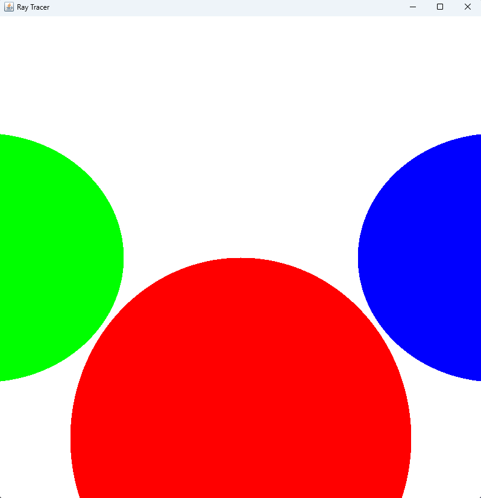

# Ray Tracer in Java

This is a simple ray tracing program written in Java. It renders a scene with three spheres (red, green, and blue) using basic ray tracing techniques. The program uses Java's `javax.swing` library to display the rendered image in a window.

---

## Features
- **Sphere Rendering**: Renders a 2D projection of a 3D scene.
- **Ray-Sphere Intersection**: Uses mathematical formulas to compute intersections between rays and spheres.
- **Interactive Display**: Displays the rendered image in a window using Java's `JFrame`.

---

## Prerequisites
To run this program, you need:
- **Java Development Kit (JDK)**: Ensure you have JDK 8 or later installed.
---

## How to Run the Program

### 1. Clone or Download the Code
- Clone this repository or download the `Ray-Tracing` folder to your local machine.

### 2. Run the Program on Different Platforms

#### Step 1: Open a Terminal or Command Prompt
- **Windows**: Open Command Prompt or PowerShell by searching for it in the Start menu.  
- **Mac**: Open the Terminal application (found in Applications > Utilities).  
- **Linux**: Open a terminal using your preferred method.

#### Step 2: Navigate to the Program Directory
Use the `cd` command to navigate to the directory containing the `RayTracer.java` file. For example:
```bash
cd path/to/your/directory
```

#### Step 3: Run the Program
Run the program directly using the following command:
```bash
java RayTracer.java
```

**Note**: Ensure that Java is properly installed and added to your system's PATH. You can verify this by running:
```bash
java -version
```
If Java is not installed or configured, refer to your operating system's instructions for setting it up.

### 4. View the Output
A window will open displaying the rendered image of three spheres (red, green, and blue) on a white background.

---

## Code Structure
The program consists of the following classes:

### 1. `Point3D`
Represents a 3D point or vector. It includes methods for vector math:
- `subtract`: Subtracts two vectors.
- `multiply`: Multiplies a vector by a scalar.
- `dot`: Computes the dot product of two vectors.
- `length`: Computes the length of a vector.
- `normalize`: Normalizes a vector to unit length.

### 2. `Sphere`
Represents a sphere in 3D space. It has:
- `center`: The center of the sphere (a `Point3D`).
- `radius`: The radius of the sphere.
- `color`: The color of the sphere.

### 3. `RayTracer`
The main class that handles rendering and display. It includes:
- **Scene Setup**: Defines the three spheres and their properties.
- **Ray Tracing Logic**:
  - `canvasToViewport`: Maps canvas coordinates to viewport coordinates.
  - `intersectRaySphere`: Computes the intersection of a ray with a sphere.
  - `traceRay`: Traces a ray and determines the color of the closest sphere.
- **Rendering**:
  - `render`: Renders the scene by tracing rays for each pixel.
  - `paintComponent`: Draws the rendered image on the screen.
- **Main Method**: Initializes the program and displays the rendered image in a window.

---

## Example Output
The program will render three spheres:
- A **red sphere** at `(0, -1, 3)`.
- A **blue sphere** at `(2, 0, 4)`.
- A **green sphere** at `(-2, 0, 4)`.

The rendered image will look like this:

